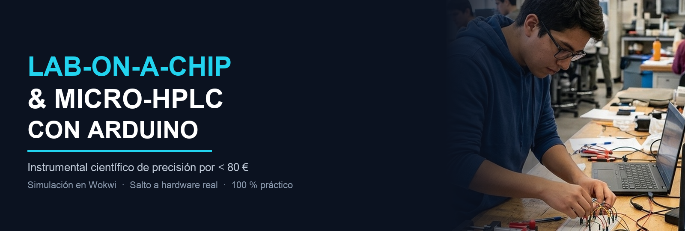
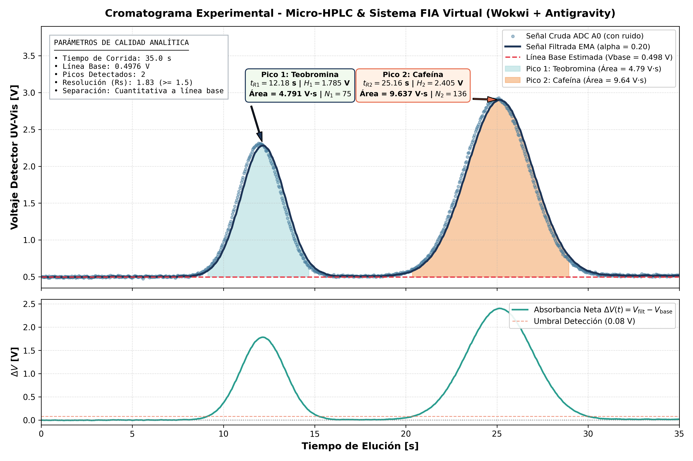
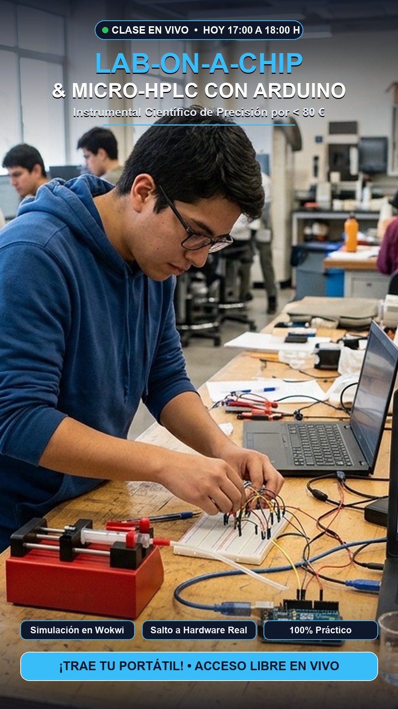
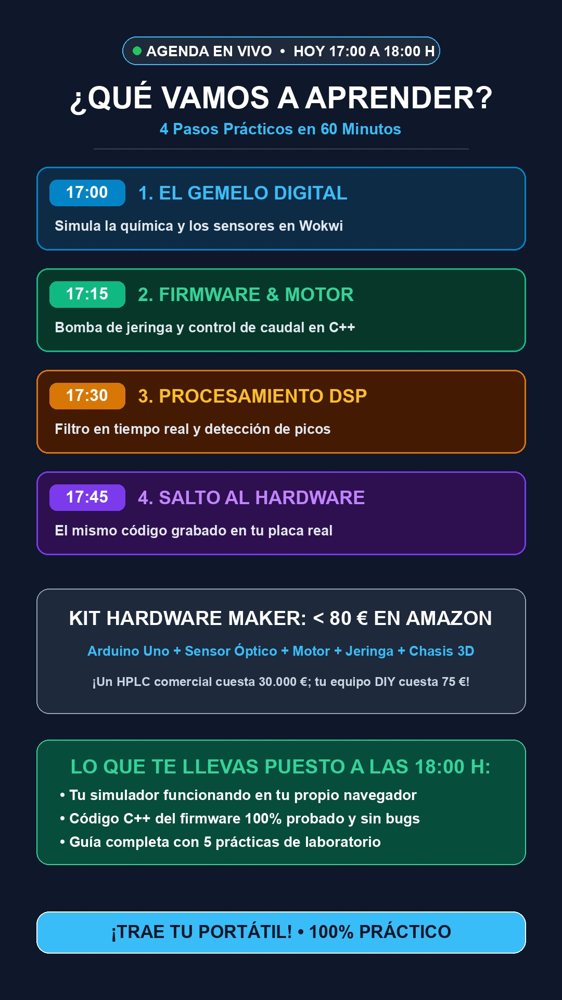

# Lab-on-a-Chip (LOC): Micro-Cromatógrafo & Sistema FIA Virtual



Sistema de instrumentación analítica virtual diseñado para la enseñanza de bioingeniería, química analítica e ingeniería de sistemas embebidos mediante **Arduino**, **Wokwi** y **Antigravity (IA)**.

El proyecto rompe la limitación tradicional de "no hay analito real" en simuladores embebidos utilizando un **Custom Chip en C (compilado a WebAssembly)** que modela elución cromatográfica en columna, ruido instrumental estocástico y deriva de línea base.

---

## 📁 Estructura del Repositorio

```text
LOC/
├── wokwi/                                 # 🧪 PROYECTO LISTO PARA WOKWI WEB / VS CODE
│   ├── README.md                          # Guía rápida de 1 minuto para el alumno
│   ├── sketch.ino                         # Firmware standalone para pegar en Wokwi
│   ├── diagram.json                       # Esquema de conexiones y componentes visuales
│   ├── libraries.txt                      # Dependencias automáticas (SSD1306, GFX)
│   ├── flow-cell-detector.chip.c          # Custom Chip en C (elución física y ruido)
│   ├── flow-cell-detector.chip.json       # Definición de pines y metadatos del chip
│   └── wokwi.toml                         # Configuración para la extensión de VS Code
│
├── docs/                                  # 📚 Documentación pedagógica y material gráfico
│   ├── diptico/                           # 📱 Díptico para WhatsApp / Instagram Stories (9:16)
│   │   ├── diptico_whatsapp_story_01.jpg  # Página 1: Portada visual con investigador y Arduino
│   │   ├── diptico_whatsapp_story_02.jpg  # Página 2: Agenda de la clase y Kit Amazon (< 80 €)
│   │   └── README.md                      # Especificaciones del díptico y difusión
│   ├── slides/                            # Diapositivas gráficas académicas 16:9 (01 a 12)
│   ├── presentacion_loc_wokwi_antigravity.pptx # Presentación PowerPoint 16:9 con notas
│   ├── 00_project_overview.md             # Fundamentos fisicoquímicos y conceptos analíticos
│   ├── 01_system_architecture.md          # Arquitectura de hardware, pinout y DSP
│   ├── 02_prompts_guide.md                # Biblioteca de prompts estructurados por fases
│   ├── 03_pedagogical_rubric.md           # Rúbrica de evaluación y competencias
│   ├── 04_lab_manual.md                   # Guía de prácticas experimentales de laboratorio
│   └── 05_presentation_slides.md          # Guión técnico de diapositivas (PowerPoint)
│
├── data/                                  # 📊 Registros experimentales
│   └── chromatogram_run.csv               # Telemetría de elución real a 25 Hz
│
├── src/                                   # Código fuente modular (PlatformIO / C++)
│   ├── config.h                           # Definición de pines y constantes analíticas
│   └── main.cpp                           # Firmware con FSM, filtrado EMA e integración
│
├── tools/                                 # Scripts de automatización y DSP en Python
│   ├── serial_plotter.py                  # Graficador en vivo en Python (Matplotlib/PySerial)
│   ├── plot_run.py                        # Generador de curvas cromatográficas con métricas
│   ├── generate_academic_slides.py        # Generador de diapositivas 16:9
│   ├── build_presentation.py              # Ensamblador de PowerPoint (.pptx)
│   └── generate_diptico_stories.py        # Generador del díptico de WhatsApp Stories
│
└── README.md                              # Este documento
```

---

## 🚀 Cómo Ejecutar la Simulación en Wokwi Web (3 Pasos)

Todos los archivos que necesitas están organizados en la carpeta **[`wokwi/`](file:///Users/davinson/Documents/Milton%20project/LOC/wokwi/)**:

1. **Abre un nuevo proyecto:** Entra a [https://wokwi.com/projects/new/arduino-uno](https://wokwi.com/projects/new/arduino-uno).
2. **Copia el Firmware:** Pega el contenido de [`wokwi/sketch.ino`](file:///Users/davinson/Documents/Milton%20project/LOC/wokwi/sketch.ino) en la pestaña `sketch.ino`.
3. **Copia el Diagrama:** Pega el contenido de [`wokwi/diagram.json`](file:///Users/davinson/Documents/Milton%20project/LOC/wokwi/diagram.json) en la pestaña `diagram.json`.
4. **Agrega el Custom Chip:**
   - En Wokwi, haz clic en el botón `+` (nuevo archivo) y crea `flow-cell-detector.chip.json`, pegando el contenido de [`wokwi/flow-cell-detector.chip.json`](file:///Users/davinson/Documents/Milton%20project/LOC/wokwi/flow-cell-detector.chip.json).
   - Haz clic en `+` de nuevo, crea `flow-cell-detector.chip.c`, pegando el contenido de [`wokwi/flow-cell-detector.chip.c`](file:///Users/davinson/Documents/Milton%20project/LOC/wokwi/flow-cell-detector.chip.c).
5. **Inicia la Simulación:** Pulsa el botón verde **Play** en Wokwi.
   - En la pantalla OLED verás: `INSTRUMENT READY - Press START [D2]`.
   - Haz clic en el pulsador verde **START**.
   - Observa cómo:
     1. El sistema estabiliza la línea base durante 3 segundos.
     2. El motor paso a paso gira a caudal constante impulsando la fase móvil.
     3. La válvula conmuta e inyecta la muestra.
     4. A los $t \approx 12\text{ s}$ eluye el primer pico (Teobromina).
     5. A los $t \approx 25\text{ s}$ eluye el segundo pico (Cafeína).
     6. Al finalizar ($35\text{ s}$), la pantalla OLED y la consola serie entregan el informe analítico completo con áreas integradas ($V \cdot s$), platos teóricos ($N$) y resolución cromatográfica ($R_s$).

---

## 📈 Visualización en Vivo con Python

Para graficar el cromatograma en tiempo real en tu ordenador:

```bash
# 1. Instalar dependencias
pip3 install matplotlib pyserial numpy

# 2. Ejecutar con datos en vivo desde el puerto serie
python3 tools/serial_plotter.py --port /dev/tty.usbmodem1101 --baud 115200

# O probar en modo de simulación gráfica (MOCK):
python3 tools/serial_plotter.py --mock
```

---

## 🎓 Metodología Pedagógica con Inteligencia Artificial

Los alumnos deben consultar [docs/02_prompts_guide.md](file:///Users/davinson/Documents/Milton%20project/LOC/docs/02_prompts_guide.md) para trabajar en 5 fases secuenciales con Antigravity:
1. **Fase 1:** Construcción y ajuste del Custom Chip químico.
2. **Fase 2:** Cableado y esquema de componentes en `diagram.json`.
3. **Fase 3:** Máquina de estados no bloqueante y control de caudal.
4. **Fase 4:** Filtrado digital (EMA), detección de ápices y cálculo de trapecios.
5. **Fase 5:** Telemetría serie e interfaz OLED.

---

## 📊 Validación Experimental y Cromatograma de Corrida

A continuación se muestra el cromatograma obtenido a partir de la corrida experimental real ejecutada en el simulador:



### Resumen Analítico Obtenido por el Firmware
- **Línea base calibrada:** $V_{\mathrm{base}} = 0.4976\text{ V}$
- **Pico 1 (Teobromina):** $t_{R1} = 12.18\text{ s}$, Altura neta $H_1 = 1.785\text{ V}$, Área integrada $= 4.791\text{ V}\cdot\text{s}$, Platos teóricos $N_1 = 75$.
- **Pico 2 (Cafeína):** $t_{R2} = 25.16\text{ s}$, Altura neta $H_2 = 2.405\text{ V}$, Área integrada $= 9.637\text{ V}\cdot\text{s}$, Platos teóricos $N_2 = 136$.
- **Resolución cromatográfica:** $R_s = 1.83$ (Separación cuantitativa completa a línea base, $R_s \ge 1.5$).

---

## 📣 Material de difusión

Carteles de convocatoria de la clase (formato vertical *story*, 1080 × 1920):




---

## 🤖 Simulación headless: Wokwi CLI y servidor MCP

Además del simulador web, Wokwi ofrece un **CLI** que permite ejecutar la simulación
desde la terminal y desde agentes de IA (Antigravity, Claude, Hermes…) mediante **MCP**.

### Instalación del CLI

```bash
curl -L https://wokwi.com/ci/install.sh | sh      # macOS / Linux
# El binario queda en ~/.wokwi/bin/wokwi-cli (enlazado en ~/bin)
```

### Token

El CLI necesita un token de Wokwi (empieza por `wok_` y mide 44 caracteres).
**No lo escribas en el repositorio.** Guárdalo en tu entorno:

```bash
export WOKWI_CLI_TOKEN="wok_..."        # o en ~/.hermes/.env / ~/.zshrc
```

### Comandos útiles

```bash
wokwi-cli lint .                        # valida diagram.json
wokwi-cli . --timeout 30000 \           # ejecuta la simulación (headless)
  --serial-log-file serial.log \
  --expect-text "INSTRUMENT READY"
wokwi-cli . --vcd-file signals.vcd      # traza del analizador lógico
wokwi-cli mcp                           # arranca el servidor MCP
```

### Servidor MCP (integración con agentes de IA)

```json
{
  "mcpServers": {
    "wokwi": {
      "command": "wokwi-cli",
      "args": ["mcp"],
      "env": { "WOKWI_CLI_TOKEN": "<tu-token>" }
    }
  }
}
```

Expone 11 herramientas: arrancar/parar/reiniciar simulación, leer y escribir la consola
serie, leer pines, **pulsar botones y girar potenciómetros** (`set_control`), **capturar la
pantalla OLED** (`take_screenshot`) y exportar el analizador lógico (`export_vcd`).

### ⚠️ Requisito para la ejecución headless

El simulador **web** no necesita nada más. Para el **CLI/MCP** hay que compilar:

1. el **firmware** a un binario (`.hex` / `.elf` / `.bin`) y apuntarlo en `wokwi.toml`
   (ahora apunta a `src/main.cpp`, que es código fuente, no un binario);
2. el **custom chip** `chip.c` a `.wasm` y declararlo en `[[chip]]` como `binary`.

Sin eso, `wokwi-cli .` falla al cargar los chips. Requiere instalar `arduino-cli`
(o PlatformIO) para el firmware.


