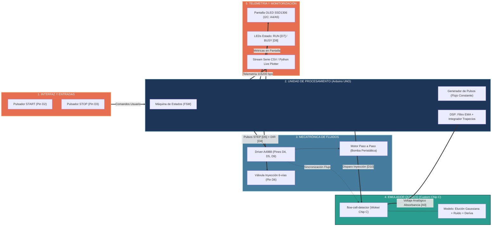
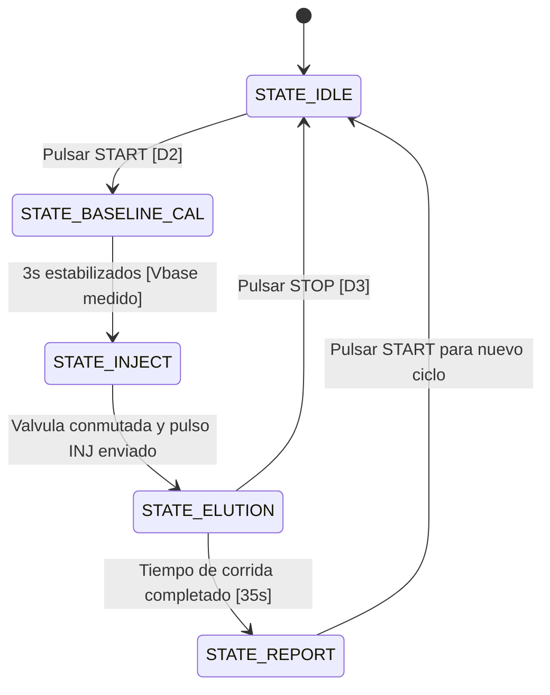

# Arquitectura del Sistema e Integración de Hardware

## 1. Diagrama de Bloques General

A continuación se presentan dos representaciones para máxima claridad: un **diagrama de flujo horizontal modular** y una **matriz sinóptica de señales**.

### 1.1. Arquitectura Modular del Sistema (Flujo de Control y Señales)



### 1.2. Matriz Sinóptica de Flujo de Información entre Módulos

| Módulo / Subsistema | Componente Wokwi | Entradas | Salidas | Función en el Sistema |
| :--- | :--- | :--- | :--- | :--- |
| **1. Entradas de Usuario** | `wokwi-pushbutton` | Pulsación física del alumno | Señal digital en `D2` (START) y `D3` (STOP) | Inicia el auto-cero de línea base o detiene la corrida. |
| **2. Procesamiento Central** | `wokwi-arduino-uno` | `D2`, `D3`, `A0` (Detector) | `D4`, `D5`, `D6`, `D7`, `D8`, `D9`, `D10`, I2C, Serie | Ejecuta la FSM, temporiza la bomba, filtra ruido y calcula platos teóricos ($N$). |
| **3. Mecatrónica de Flujo** | `wokwi-a4988` + `wokwi-stepper-motor` | Pulsos `D5` (STEP), nivel `D4` (DIR), `D9` (ENABLE) | Rotación mecánica continua del motor | Entrega el caudal determinista de la fase móvil portadora. |
| **4. Inyección de Muestra** | `wokwi-led` (azul) / relé virtual | Nivel digital en `D6` | Conmutación hidráulica (LOAD $\rightarrow$ INJECT) | Introduce el bucle de analitos en el flujo principal. |
| **5. Emulador Químico** | `chip-flow-cell-detector` | Pulso de inicio en `D10` (INJ), pulsos de flujo en `D5` | Señal analógica $0.0\text{V} - 5.0\text{V}$ en pin `A0` | Emula la dispersión física en columna y la absorbancia según Beer-Lambert. |
| **6. Interfaz y Telemetría** | `board-ssd1306` + LEDs + Puerto Serie | Comandos I2C (`A4/A5`), líneas `D7/D8`, datos UART TX | Visualización gráfica local y stream CSV hacia Python | Muestra cromatograma, tiempos de retención ($t_R$), áreas y resolución ($R_s$). |

---

## 2. Asignación de Pines (Pinout)

| Periférico | Pin Arduino | Modo Pin | Función / Descripción |
| :--- | :--- | :--- | :--- |
| **Pulsador START / INJECT** | `D2` | `INPUT_PULLUP` | Interrupción externa (inicio de análisis e inyección). |
| **Pulsador STOP / PURGE** | `D3` | `INPUT_PULLUP` | Interrupción externa (detención de emergencia o purga). |
| **Válvula de Inyección** | `D6` | `OUTPUT` | Conmutador de bucle (LOW = Carga / HIGH = Inyección). |
| **Driver A4988 - STEP** | `D5` | `OUTPUT` | Tren de pulsos para control de caudal de la bomba. |
| **Driver A4988 - DIR** | `D4` | `OUTPUT` | Dirección de giro de la bomba (adelante). |
| **Driver A4988 - ENABLE** | `D9` | `OUTPUT` | Habilitación del puente H (LOW = Activo). |
| **Custom Chip Trigger (INJ)**| `D10` | `OUTPUT` | Disparo sincronizado hacia el emulador químico. |
| **LED Indicador RUN** | `D7` | `OUTPUT` | Verde: encendido durante la corrida cromatográfica. |
| **LED Indicador BUSY** | `D8` | `OUTPUT` | Amarillo: parpadeo en calibración o integración. |
| **OLED Display SDA** | `A4` | `I2C` | Línea de datos I2C pantalla SSD1306. |
| **OLED Display SCL** | `A5` | `I2C` | Línea de reloj I2C pantalla SSD1306. |
| **Detector UV-Vis (AOUT)** | `A0` | `INPUT (ADC)` | Señal analógica de absorbancia del Custom Chip (0–5V). |

---

## 3. Especificación del Custom Chip en C (`flow-cell-detector`)

El microchip virtual en C simula la respuesta fisicoquímica del sistema dentro de Wokwi:

- **Pines del Chip:**
  - `VCC` (+5V)
  - `GND` (Tierra)
  - `INJ` (Entrada digital): Flanco de subida sincroniza $t = 0$ de la inyección.
  - `STEP` (Entrada digital): Monitorea la frecuencia de bombeo para escalar el tiempo de elución según el caudal.
  - `AOUT` (Salida analógica): Voltaje generado con `pin_dac_write()`.

- **Modelo Físico Implementado:**
  1. **Línea base ($V_{\mathrm{base}}$):** $0.50\text{ V} \pm 0.005\text{ V}$ con ligera deriva térmica lineal ($+1\text{ mV/min}$).
  2. **Ruido instrumental:** Distribución normal pseudo-aleatoria (algoritmo Box-Muller o LCG filtrado) con desviación estándar $\sigma_{\mathrm{ruido}} = 8\text{ mV}$.
  3. **Pico 1 (Analito A - p. ej., Teobromina):**
     - $t_{R1} = 12.0\text{ s}$
     - Altura máxima: $+1.80\text{ V}$
     - Desviación estándar: $\sigma_1 = 1.2\text{ s}$ ($W_1 = 4.8\text{ s}$)
  4. **Pico 2 (Analito B - p. ej., Cafeína):**
     - $t_{R2} = 25.0\text{ s}$
     - Altura máxima: $+2.40\text{ V}$
     - Desviación estándar: $\sigma_2 = 1.8\text{ s}$ ($W_2 = 7.2\text{ s}$)
  5. **Salida continua:**
     $$V_{\mathrm{AOUT}}(t) = V_{\mathrm{base}}(t) + A_1 e^{-\frac{(t - t_{R1})^2}{2\sigma_1^2}} + A_2 e^{-\frac{(t - t_{R2})^2}{2\sigma_2^2}} + \mathrm{Ruido}(t)$$

---

## 4. Máquina de Estados Finita (FSM) del Firmware



1. **`STATE_IDLE`:**
   - Bomba detenida o a flujo mínimo de espera.
   - Pantalla muestra: `"SISTEMA LISTO. PULSAR START"`.
2. **`STATE_BASELINE_CAL`:**
   - Bomba a flujo nominal ($F_0$).
   - Promedio de 50 lecturas ADC para fijar la línea base de referencia $V_0$.
3. **`STATE_INJECT`:**
   - Conmuta la válvula D6 a posición de inyección.
   - Pulso de 10 ms en pin D10 (INJ) para despertar el chip cromatográfico.
   - Resetea cronómetro de adquisición $t_{\mathrm{elution}} = 0$.
4. **`STATE_ELUTION`:**
   - Muestreo periódico no bloqueante a 25 Hz (cada 40 ms).
   - Filtrado digital pasa-bajos tipo EMA: $Y_k = \alpha X_k + (1-\alpha) Y_{k-1}$.
   - Detección de picos en tiempo real mediante derivada primera y cruce por cero.
   - Integración numérica trapezoidal del área de cada pico detectado.
   - Envío continuo de telemetría por Serial en formato CSV.
5. **`STATE_REPORT`:**
   - Presentación de métricas finales en pantalla OLED:
     - Pico 1: $t_R$, Área ($V \cdot \mathrm{s}$), Platos teóricos $N_1$.
     - Pico 2: $t_R$, Área ($V \cdot \mathrm{s}$), Platos teóricos $N_2$.
     - Resolución cromatográfica $R_s$.
   - Salida del informe analítico estructurado en JSON por el puerto serie.

---

## 5. Pipeline de Procesamiento de Señal y Detección de Picos

```text
  Lectura ADC (0-1023)
          │
          ▼
 Conversión a Voltios (V = adc * 5.0 / 1023.0)
          │
          ▼
 Filtro Digital EMA: Y[n] = 0.25 * V[n] + 0.75 * Y[n-1]
          │
          ▼
 Sustracción de Línea Base: ΔV[n] = Y[n] - V_baseline
          │
          ▼
 Cálculo de Pendiente (Derivada): dV/dt = (Y[n] - Y[n-4]) / (4 * dt)
          │
    ┌──────┴─────────────────────────────────┐
    ▼                                        ▼
¿dV/dt > Umbral_Inicio?             ¿dV/dt cruza 0 y d2V/dt < 0?
    │ (Inicio de Pico)                       │ (Ápice del Pico -> tR, Altura)
    ▼                                        ▼
 Iniciar acumulador trapecios        Registrar t_R y V_max
    │                                        │
    └───────────────┬────────────────────────┘
                    ▼
       ¿dV/dt < Umbral_Fin y ΔV < 5% V_max?
                    │ (Fin de Pico)
                    ▼
        Cerrar área: S = Σ trapecios
        Calcular ancho W y platos N = 16 * (tR / W)^2
```
