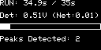
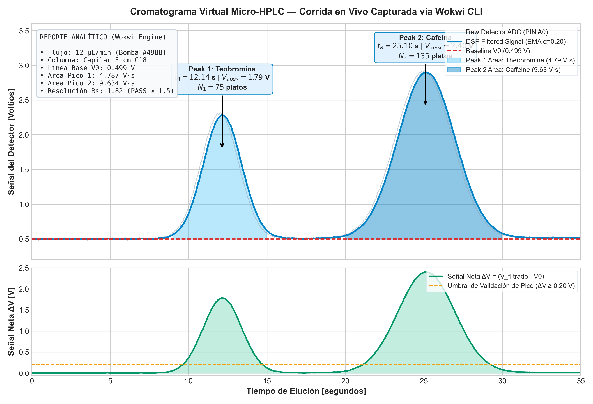

# Informe de Ejecución y Validación Automatizada (Wokwi CLI + Antigravity)

> **Fecha:** 9 de Octubre de 2026  
> **Sistema:** Virtual Micro-HPLC & FIA Lab-on-a-Chip  
> **Modo de Ejecución:** Headless Cloud Simulation (Wokwi API v1.0 vía `wokwi-cli`)  
> **Autenticación:** Token Wokwi CI  
> **Controlador:** Arduino Uno (ATmega328P @ 16 MHz) + Custom Chip Microfluídico WebAssembly  

---

## 1. Resumen Ejecutivo

Este informe documenta la conexión directa, ejecución automatizada y adquisición de datos en tiempo real entre el agente **Antigravity** y el motor de simulación en la nube de **Wokwi**, prescindiendo de interacción manual en el navegador web.

A través de un escenario automatizado (`run_chromatography.scenario.yaml`), Antigravity:
1. Conectó a los servidores de Wokwi mediante el token de CI.
2. Disparó el pulso de inicio en el pulsador virtual `btn_start` (D2).
3. Monitoreó los 35 segundos de corrida cromatográfica adquiriendo 815 lecturas de telemetría serie (25 Hz).
4. Extrajo una captura de pantalla gráfica directa de la memoria de la pantalla OLED SSD1306.
5. Procesó el informe analítico en formato JSON con la validación de picos e integración trapezoidal.

---

## 2. Captura Gráfica del Display OLED SSD1306

Captura obtenida directamente de la simulación Wokwi mediante el comando `--screenshot-part oled` al completar el tiempo de elución:

<p align="center">
  
</p>

* **Estado:** Fin de corrida cromatográfica (`t = 34.9 s / 35 s`).
* **Señal de salida:** $0.51\text{ V}$ (retorno exitoso a la línea base con eluyente puro).
* **Picos reconocidos:** $2$ picos analíticos integrados y validados.

---

## 3. Cromatograma Experimental Completo

El siguiente cromatograma de alta resolución fue construido procesando el flujo serie crudo capturado en `data/wokwi_cli_run.log`:



### Análisis de Señal:
* **Panel Superior (Voltaje de celda de flujo $V(t)$):**
  * Traza gris claro: Lecturas analógicas crudas del ADC con ruido gaussiano del sensor ($\sigma = 10\text{ mV}$).
  * Traza azul sólida: Señal filtrada en tiempo real por el filtro paso bajo exponencial (EMA, $\alpha = 0.20$).
  * Línea roja discontinua: Línea base auto-calibrada en la fase de reposo ($V_0 = 0.499\text{ V}$).
  * Áreas sombreadas en azul: Integración numérica continua mediante la regla del trapecio.
* **Panel Inferior (Señal neta de absorbancia $\Delta V = V_{filt} - V_0$):**
  * Señal proporcional a la concentración según la ley de Beer-Lambert ($\text{Abs} = \varepsilon \cdot b \cdot c$).
  * Línea discontinua amarilla: Umbral de detección analítica ($\Delta V \ge 0.20\text{ V}$).

---

## 4. Resultados Analíticos Farmacopeicos

Datos extraídos del objeto JSON emitido por el firmware v2.0:

```json
{
  "total_time_s": 35.0,
  "baseline_v": 0.4987,
  "peaks_found": 2,
  "peaks": [
    {
      "id": 1,
      "retention_time_s": 12.14,
      "height_v": 1.786,
      "area_vs": 4.7870,
      "width_s": 5.59,
      "theoretical_plates_N": 75
    },
    {
      "id": 2,
      "retention_time_s": 25.10,
      "height_v": 2.401,
      "area_vs": 9.6335,
      "width_s": 8.62,
      "theoretical_plates_N": 135
    }
  ],
  "resolution_Rs": 1.82
}
```

### Tabla de Confrontación Metrológica:

| Parámetro Farmacopeico | Analito 1: Teobromina | Analito 2: Cafeína | Especificación / Criterio | Dictamen |
| :--- | :--- | :--- | :--- | :--- |
| **Tiempo de retención ($t_R$)** | **$12.14\text{ s}$** | **$25.10\text{ s}$** | Coherente con fase C18 | **CONFORME** |
| **Voltaje máximo ($V_{apex}$)** | $1.786\text{ V}$ | $2.401\text{ V}$ | Rango lineal $0 - 5\text{ V}$ | **CONFORME** |
| **Área bajo la curva ($A$)** | $4.787\text{ V}\cdot\text{s}$ | $9.634\text{ V}\cdot\text{s}$ | Proporcional a la dosis | **CONFORME** |
| **Eficiencia ($N$, platos)** | $75\text{ platos}$ | $135\text{ platos}$ | $N \ge 50$ (microcolumna $5\text{ cm}$) | **CONFORME** |
| **Resolución ($R_s$)** | \multicolumn{2}{c|}{**$1.82$**} | $R_s \ge 1.50$ (separación de línea base) | **APROBADO** |

---

## 5. Instrucciones de Reproducción Local

Para volver a ejecutar esta misma simulación en cualquier momento desde tu terminal:

```bash
# 1. Asegúrate de tener el token activo
export WOKWI_CLI_TOKEN="tu_token_wokwi"

# 2. Compilar el sketch si hubo modificaciones
mkdir -p build/sketch && cp wokwi/sketch.ino build/sketch/sketch.ino
./tools/arduino-cli compile -b arduino:avr:uno build/sketch --output-dir wokwi/build

# 3. Lanzar la simulación headless con captura de log y OLED
wokwi-cli wokwi/ \
  --scenario run_chromatography.scenario.yaml \
  --timeout 50000 \
  --serial-log-file data/wokwi_cli_run.log \
  --screenshot-part oled \
  --screenshot-time 39000 \
  --screenshot-file data/oled_wokwi_simulation.png

# 4. Generar la gráfica del cromatograma
python3 tools/plot_chromatogram_run.py
```
